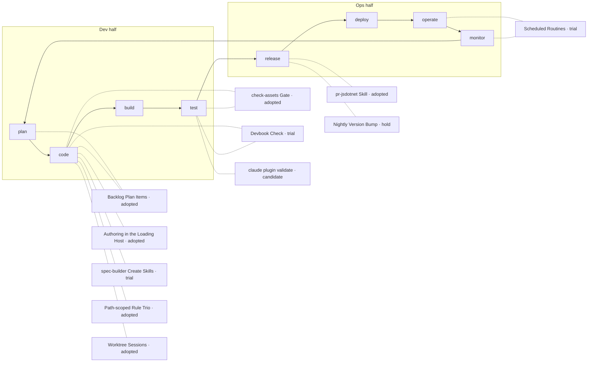

# AI Adoption Map

```meta
status: trial
type: adoption-map
```

> How this marketplace is built with AI. Agents author every asset here, so the record is about
> which parts of that are the settled way of working and which are still being tried.

## How the Loop Reads Here

This repository ships Markdown and JSON that two hosts load; it deploys and operates nothing.
Merging to `main` is the release, because the marketplace installs from `main`. So the loop's
dev half carries almost everything: `code` is authoring an asset, `test` is checking it, and
`release` is the pull request and the version.

| File | Covers |
| --- | --- |
| [01-authoring.md](01-authoring.md) | Writing an asset in the host that loads it, with spec-builder's contracts and the rule trio |
| [02-carrying-a-change.md](02-carrying-a-change.md) | Backlog plans, worktree sessions, the pull request, the version, and scheduled routines |
| [03-checking.md](03-checking.md) | `check-assets.mjs`, `claude plugin validate`, and the devbook check |

## Adoption Picture



`build` and `deploy` are empty: nothing here is compiled or deployed. `operate` and `monitor`
hold one usage on trial: the local scheduled routines, not yet run.

Not recorded: `claude plugin eval`. No plugin here has an eval suite and no session has run one,
so it gets a chapter when one does.

## Reading and Extending

`status` is the adoption ladder in `devbook-ai.md` — `candidate`, `trial`, `adopted`, `hold`,
`retired` — rating the way of working, not the tool; the tool's own rating is in
`.devbook/tech/`. `date` is the day the current rating was set. Add a usage as a `##` chapter in
the file for the part of the flow it serves, point `depends-on` at its `tech/` chapter, add its
box to the picture above in the same change, and run
`node .devbook/_tools/devbook-meta/build.mjs --check`.
