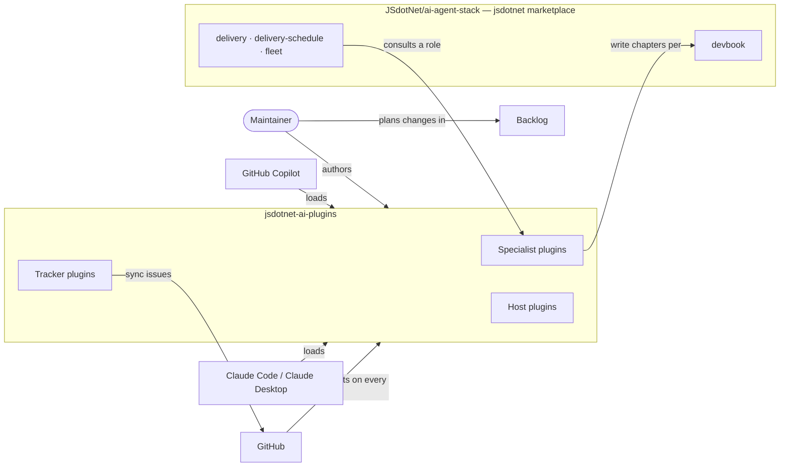

# 03. Context and Scope

```meta
related: [".devbook/tech/hosts.md", ".devbook/tech/tooling.md", ".devbook/arc42/adr/flow-control.md"]
```

The marketplace is a set of files. Nothing here runs on its own: a host loads a plugin, and a
person or a flow consults what it loaded.



## Hosts

```meta
related: [".devbook/tech/hosts.md#copilot-cli-plugin-api", ".devbook/tech/hosts.md#claude-code-plugin-api"]
```

| Host | Reads | Only it has |
| --- | --- | --- |
| GitHub Copilot (CLI and app) | `.github/plugin/plugin.json`, root `hooks.json`, agents by their Copilot tool ids | canvas extensions — `copilot-app` builds on them |
| Claude Code, and Claude Desktop through it | `.claude-plugin/plugin.json`, `hooks/hooks.json`, agents by their Claude tool names, `.claude-plugin/marketplace.json` | MCP Apps and `.mcpb` extensions — `claude-desktop` builds on them |

Both read the same agents, skills, and contracts; how one file satisfies both is
[08 — One File, Two Hosts](08-crosscutting-concepts.md#one-file-two-hosts).

## Outside the Marketplace

```meta
```

| Neighbour | What it owns | The interface |
| --- | --- | --- |
| Delivery engine — `delivery`, `delivery-schedule`, `fleet` in `JSdotNet/ai-agent-stack` | Staged flows, gates, the pull-request lane, schedules, cross-session fan-out, model selection | Consults a specialist by role (`architecture`, `docs`, …) through the repository's `bindings`; a specialist never names the engine. |
| devbook, in `JSdotNet/ai-agent-stack` | The `.devbook/` folder convention, its rules, and the `devbook-meta` check | The specialists write `arc42/`, `domain/`, and `design/` chapters to its rules; this repository adopts it for its own `arc42/`, `tech/`, and `ai/`. |
| Backlog | Plans and work items for changes to this repository | Items are pasted into a session and run by `backlog-run-plan-item`; nothing in a plugin depends on it. |
| GitHub | The repository, pull requests, CI | `check-assets.yml` gates every pull request; `auto-merge.yml` merges a non-draft pull request once every other check on its head commit is green; the nightly workflow bumps changed plugins' versions. |

The flow control that used to ship here moved to the engine on 2026-09-14; see
[the flow-control decision](adr/flow-control.md).
