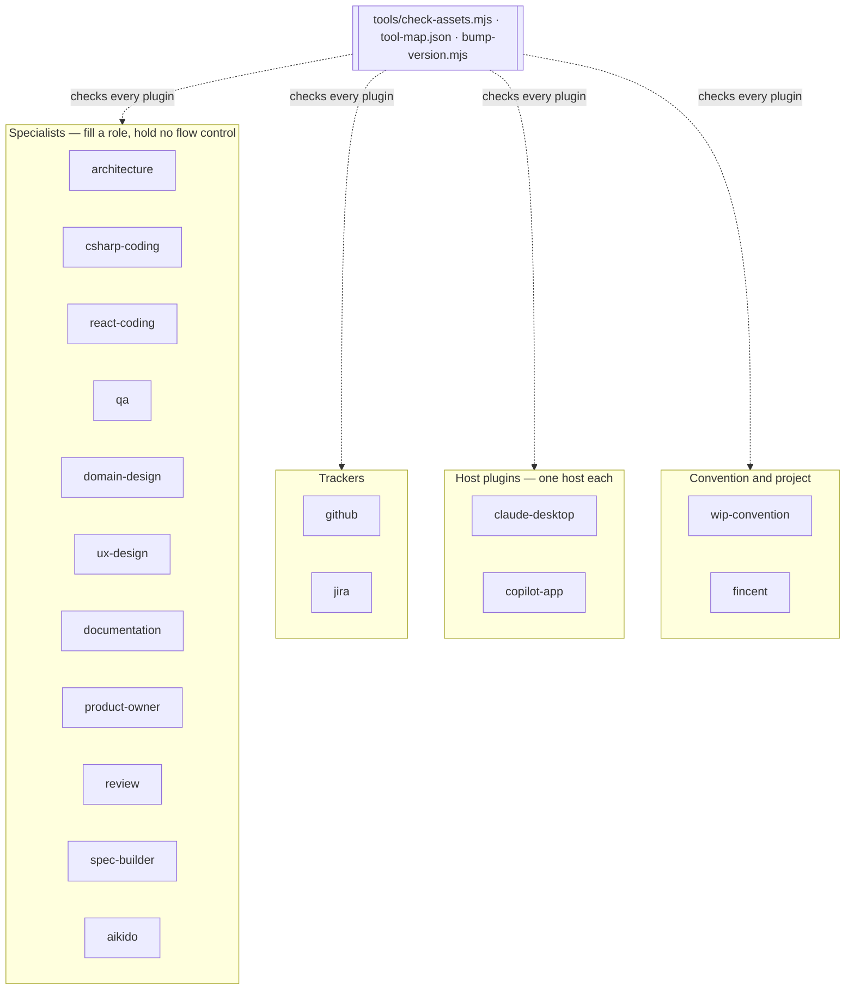

# 05. Building Block View

```meta
related: [".devbook/arc42/building-blocks/README.md", ".devbook/arc42/adr/flow-control.md"]
```

Level 1 is one block per plugin: a folder under `plugins/` that installs on its own and
reaches nothing in another plugin except through a declared dependency. The blocks are grouped
by kind, because the kind decides what a block may hold — a specialist fills a role and holds
no flow control, a host plugin is built on one host's rendering surface and ships one
manifest, a tracker talks to an external issue system.



Every block shares one shape — `agents/`, `skills/`, `resources/` read by both hosts; one
manifest and one hook file per host — described in
[08 — One File, Two Hosts](08-crosscutting-concepts.md#one-file-two-hosts). Versions and
install strings are in `copilot-plugins.md`, not here. A block whose inside is read more
often than its row has its own whitebox under [building-blocks/](building-blocks/README.md).

## Specialists

```meta
related: [".devbook/arc42/adr/flow-control.md"]
```

| Block | Responsibility | Exposes |
| --- | --- | --- |
| `architecture` | arc42 chapters, decision and debt records, C4, sequence, state, and deployment diagrams | agent `architect`; 7 skills; fills the `architecture` role |
| `csharp-coding` | C# .NET implementation, TDD, refactoring, review, NuGet, Aspire, OpenTelemetry | agent `coding`; 13 skills; the `implement` and `verify` services |
| `react-coding` | React and TypeScript implementation bound to a .NET API contract | agent `frontend`; 4 skills; the `implement` and `verify` services |
| [`qa`](building-blocks/qa.md) | Runtime validation through Aspire and Playwright, with evidence and log monitoring | agents `qa`, `qa-monitor`; 6 skills; the `aspire` and `playwright` MCP servers |
| `domain-design` | Bounded contexts, ubiquitous language, domain models, context maps | agent `domain-architect`; 8 skills; the `domain` role |
| `ux-design` | Wireframes, user flows, design guidelines, UI reviews | agent `ux-designer`; 4 skills; the `ux` role |
| `documentation` | How-tos, explanations, articles, proposals, infographics, profiles | agents `documentation`, `profile`; 9 skills; the `docs` role |
| `product-owner` | Epics, stories, and bugs as Markdown | agent `product-owner`; 3 skills |
| `review` | TODO-, question-, and improvement-driven review passes | 4 skills, no agent |
| [`spec-builder`](building-blocks/spec-builder.md) | Authoring agents, rules, contracts, skills, plugins, and workflows to this repository's dual-host rules | agent `spec-builder`; 5 skills; the `create-*` contracts |
| `aikido` | Aikido Security scanning, triage, and fixes | agent `aikido`; 5 skills |

## Trackers

```meta
```

| Block | Responsibility | Exposes |
| --- | --- | --- |
| `github` | Issue sync, pull requests, Actions workflows, Dependabot | 4 skills |
| `jira` | Jira issues from approved Markdown backlog artifacts | 2 skills |

## Host Plugins

```meta
related: [".devbook/arc42/tdr/3-dashboard-code-copied.md"]
```

| Block | Responsibility | Exposes |
| --- | --- | --- |
| [`claude-desktop`](building-blocks/claude-desktop.md) | The run dashboard, diagram, and document viewers as an MCP server, plus the Claude-side session skills | `orch-dashboard` MCP server; skills `start`, `session-handoff`, `create-pull-request`; telemetry hooks; the `context-view` function-hook pane. Claude manifest only |
| [`copilot-app`](building-blocks/copilot-app.md) | The same viewers as Copilot canvas extensions, plus session upkeep | extensions `orch-dashboard`, `diagram-canvas`, `markdown-canvas`; skill `update-open-sessions`. Copilot manifest only |

The two carry the same run model on different transports; their shared modules are copied
rather than shared — [TDR 3](tdr/3-dashboard-code-copied.md).

## Convention and Project

```meta
```

| Block | Responsibility | Exposes |
| --- | --- | --- |
| `wip-convention` | The `.wip/` work-in-progress artifact layout other plugins write to | 1 skill; `resources/wip-*.md` contracts |
| `fincent` | One project's story review, estimation, PR review, sprint, and demo workflows | 16 skills |
