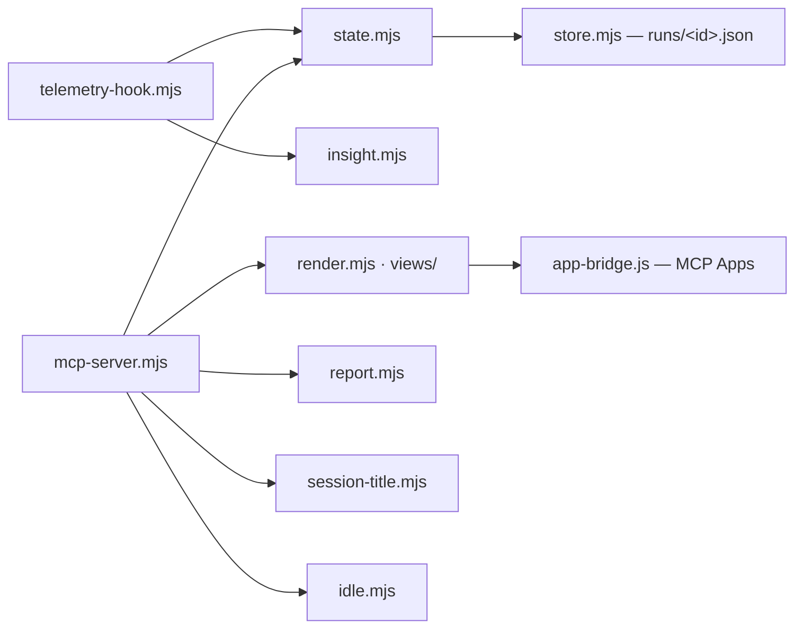

# claude-desktop

```meta
related: [".devbook/arc42/05-building-block-view.md#host-plugins", ".devbook/tech/hosts.md#claude-desktop", ".devbook/tech/shared.md#mcp-apps"]
```

The Claude host plugin. It owns the `orch-dashboard` MCP server — a live run dashboard, a
Mermaid viewer, and a Markdown viewer — the hooks that feed it tool activity, and three
session skills. It holds no flow: the staged flows that report to it are `delivery@jsdotnet`,
which resolves this server as a delivery surface. Its Copilot counterpart is `copilot-app`.

It ships a Claude manifest only. Its root `hooks.json` is a Copilot guard that tells a Copilot
user the plugin is Claude-only and keeps Copilot from falling back to `hooks/hooks.json`.

## Interfaces

```meta
```

### orch-dashboard MCP Server

```meta
```

Tools: `start_run`, `update_stage`, `record_prompt`, `set_run_context`, `finish_run`,
`list_runs`, `get_run`, `export_report`, `open_dashboard`, `render_diagram`,
`render_markdown`, `get_view`, `pop_view`. The contract is
`resources/orch-dashboard-contract.md`; usage for a caller is `resources/dashboard-usage.md`.

It renders two ways from one implementation, negotiated per host: as MCP App `ui://`
resources inline in Claude Desktop, and over HTTP on `127.0.0.1` elsewhere, including Claude
Code, where the agent opens the URL in the in-app browser.

### Skills

```meta
```

`start`, `session-handoff`, and `create-pull-request`.

### Counterparts in copilot-app

```meta
```

A canvas cannot be translated to Claude, so it was rebuilt on a different transport. Keep the
two plugins' stage names and dashboard contract in step.

| `copilot-app` | `claude-desktop` |
| --- | --- |
| `orch-dashboard` canvas panel | An MCP App panel inline in Claude Desktop, and a page on `127.0.0.1` in other hosts |
| Canvas actions (`invoke_canvas_action`) | MCP tools with the same names and arguments |
| The `diagram-canvas` and `markdown-canvas` extensions | The `/mermaid` and `/markdown` routes, driven by `render_diagram` and `render_markdown` |
| Host session telemetry events | The telemetry hooks, plus the session transcript |
| No equivalent | The `SessionEnd` hook, which stamps an unfinished run idle |

### Hooks

```meta
```

A `SessionStart` command hook printing `hooks/session-start-context.md`, and
`telemetry-hook.mjs` on `SessionStart`, `PreToolUse`, `PostToolUse`, `SubagentStop`,
`PreCompact`, `Stop`, and `SessionEnd`.

## Structure

```meta
```



| Part | Responsibility |
| --- | --- |
| `mcp-server.mjs` | The MCP tools, the HTTP server, and the `ui://` resources |
| `state.mjs` | Resolves the state directory outside the repository, so a thrown-away worktree does not lose its runs; holds `active.json` |
| `store.mjs` | One JSON file per run |
| `telemetry-hook.mjs`, `insight.mjs` | Turn Claude Code hook events into per-stage tool activity |
| `render.mjs`, `views/`, `app-bridge.js` | The dashboard shell, the diagram and document pages, and the MCP Apps bridge |
| `report.mjs` | Markdown and self-contained HTML reports of a run |
| `session-title.mjs` | Derives a session title from where a run's output landed |
| `idle.mjs` | Stamps an abandoned run idle so its elapsed time stops growing |

`render.mjs`, `report.mjs`, `store.mjs`, and `insight.mjs` began as copies of `copilot-app`'s;
they are not kept in step — [TDR 3](../tdr/3-dashboard-code-copied.md).

## Dependencies

```meta
```

| Depends on | Mechanism |
| --- | --- |
| Node.js | Runs the server and every hook |
| Claude Code plugin API | `mcpServers` in `.claude-plugin/plugin.json`, command hooks |
| MCP Apps | Inline rendering in Claude Desktop |
| MCPB CLI | `scripts/Build-DesktopExtension.ps1` packs the server as a Desktop extension |

| Depended on by | Mechanism |
| --- | --- |
| `delivery@jsdotnet` flows | Resolve the server as a delivery surface from the live tool list and call its run tools |
