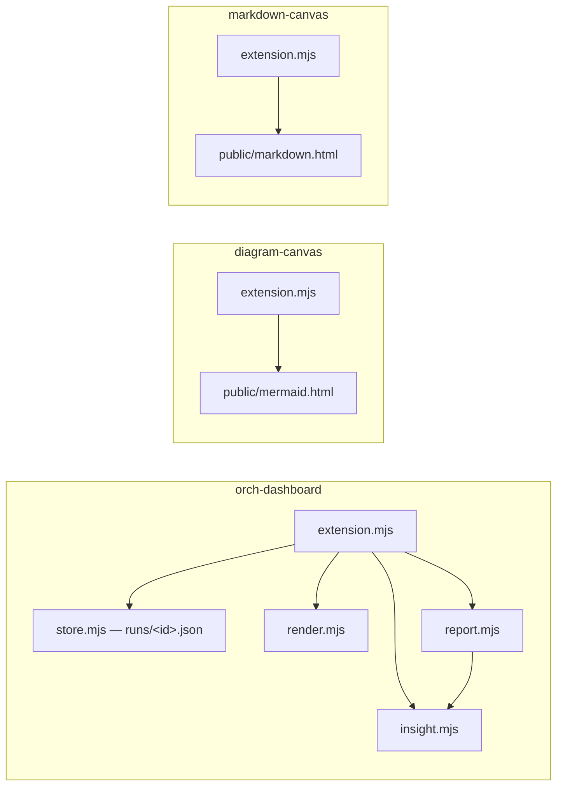

# copilot-app

```meta
related: [".devbook/arc42/05-building-block-view.md#host-plugins", ".devbook/arc42/building-blocks/claude-desktop.md", ".devbook/tech/hosts.md#copilot-app-extension-sdk", ".devbook/tech/shared.md#mermaid"]
```

The GitHub Copilot App host plugin. It gives a run a visual surface inside the Copilot App —
a live run dashboard, a Mermaid viewer, and a Markdown viewer, each a canvas extension — and
ships one session skill. It holds no flow: a flow that reports to the dashboard resolves the
canvas as its run surface and drives it, and the content plugins whose output the viewers
show never reference a canvas. Its Claude counterpart is `claude-desktop`.

It ships a Copilot manifest only, and the manifest carries `skills/` alone: a canvas is not
installed by the plugin mechanism, so each extension is a separate opt-in install.

## Interfaces

```meta
```

### orch-dashboard Canvas

```meta
```

Canvas `orch-dashboard`, provider `plugin:copilot-app:orch-dashboard`, opened with the fixed
instance id `orch-dashboard`. Actions: `start_run`, `record_prompt`, `set_run_context`,
`update_stage`, `finish_run`, `list_runs`, `get_run`. The contract a caller follows —
provider resolution, cadence, no hand-written token figures — is
`resources/dashboard-contract.md`; the full action contract is the extension's `README.md`.

It installs with the host's extension installer from a folder URL, at project, user, or
session scope. The panel is a page served on `127.0.0.1`, with report and evidence routes
under `/api/runs/`.

### diagram-canvas and markdown-canvas

```meta
```

| Extension | Canvas | Actions |
| --- | --- | --- |
| `diagram-canvas` | `mermaid-diagram` | `render_diagram`, `show_explanation`, `get_state`, `clear` |
| `markdown-canvas` | `markdown-preview` | `render_markdown`, `get_state`, `clear` |

Each carries its own `.github/plugin/plugin.json` and installs as a plugin of its own,
independently of `copilot-app` and of each other. When a flow opens them is
`resources/canvas-usage.md`: the file artifact stays the source of truth, a canvas is a
preview beside it, and a missing canvas never blocks a stage.

### Skill

```meta
```

`update-open-sessions` rebases or merges every open session worktree onto the latest source
branch, and reports the sessions it left untouched on conflict.

## Structure

```meta
```



| Part | Responsibility |
| --- | --- |
| `orch-dashboard/extension.mjs` | Joins the session, registers the canvas and its actions, serves the panel over HTTP, and subscribes to session telemetry |
| `store.mjs` | One JSON file per run, under the session workspace's `orchestration-runs/`, or under the Copilot home when the session has no workspace |
| `insight.mjs` | Turns tool, sub-agent, usage, compaction, and truncation events into per-stage activity and the context gauge |
| `render.mjs`, `report.mjs` | The dashboard shell, and Markdown and self-contained HTML reports of a run |
| `diagram-canvas`, `markdown-canvas` | One canvas each: an HTTP page per instance, pushed updates over Server-Sent Events, and the render actions |

The three extensions share no code. `claude-desktop`'s `render.mjs`, `report.mjs`,
`store.mjs`, and `insight.mjs` began as copies of the dashboard's —
[TDR 3](../tdr/3-dashboard-code-copied.md).

## Dependencies

```meta
```

| Depends on | Mechanism |
| --- | --- |
| Copilot app extension SDK | `@github/copilot-sdk/extension`: `joinSession`, `createCanvas`, and the session event stream |
| Node.js | Runs every extension |
| git | `update-open-sessions` walks `git worktree list` and rebases or merges each branch |

| Depended on by | Mechanism |
| --- | --- |
| `delivery@jsdotnet` flows | Resolve the dashboard as a delivery surface and call its actions, per `resources/dashboard-contract.md` |
| A flow coordinating `architecture`, `domain-design`, `ux-design`, `documentation`, `product-owner` | Opens the viewers beside the file artifacts those plugins write, per `resources/canvas-usage.md` |
| `claude-desktop` | Keeps the same stage names and dashboard contract on its own transport |
