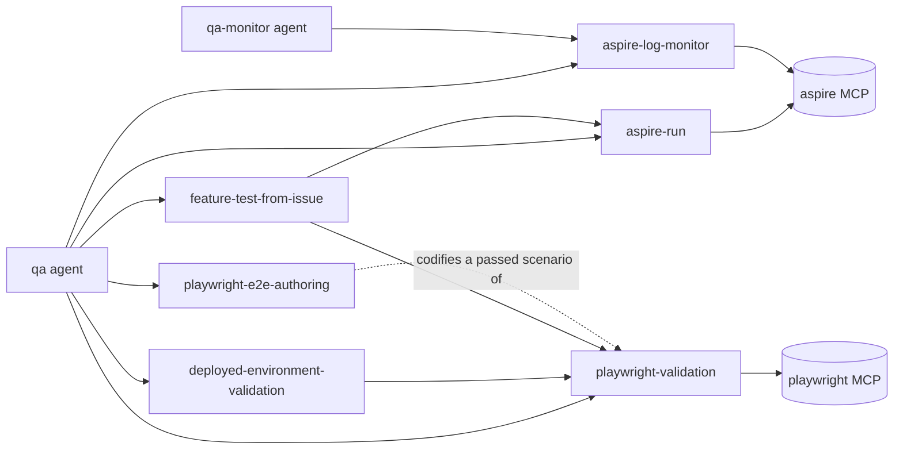

# qa

```meta
related: [".devbook/arc42/05-building-block-view.md#specialists", ".devbook/tech/shared.md#aspire-mcp-server", ".devbook/tech/shared.md#playwright-mcp-server", ".devbook/arc42/adr/flow-control.md"]
```

The runtime validation specialist, and the exemplar for the specialists: a role filled by an
agent, skills that carry the procedure, MCP servers the plugin declares itself, and no flow
control. It starts an application through Aspire, drives browser scenarios through Playwright,
watches Aspire logs and traces for the whole session, and returns a report whose every
pass and fail carries an evidence path.

It runs invoked by a person or as a caller's QA delegate. Without a user turn it returns a
decision to its caller rather than asking; it names where an out-of-scope finding belongs and
never hands it off.

## Interfaces

```meta
```

### Agents

```meta
```

| Agent | Role |
| --- | --- |
| `qa` | Runs the application or targets a deployed one, validates scenarios, writes the report under `.wip/qa/<feature>/` |
| `qa-monitor` | A persona split of `qa`: watches logs and traces of an application already running, correlates findings to scenario checkpoints, returns a monitoring summary |

The caller settles monitoring ownership before `qa` starts: caller-owned means the caller runs
`qa-monitor` and merges its summary; otherwise `qa` monitors inline, and that is the default.

### Skills

```meta
```

`aspire-run`, `aspire-log-monitor`, `playwright-validation`, `feature-test-from-issue`,
`deployed-environment-validation`, and `playwright-e2e-authoring`.

### MCP Servers

```meta
```

| Server | Command | Used for |
| --- | --- | --- |
| `aspire` | `aspire agent mcp` | Resources, console and structured logs, traces, resource commands |
| `playwright` | `npx -y @playwright/mcp@latest` | The `browser_*` tools: navigation, input, snapshots, screenshots |

Both are declared under `mcpServers` in both manifests, and the agents grant each server in
the plugin-namespaced and the bare spelling —
[Tool Map](../08-crosscutting-concepts.md#tool-map).

### Hooks

```meta
```

A `sessionStart` prompt holding the evidence rule — Aspire for every run, monitoring for the
whole session, an evidence path on every browser finding, a shallower depth recorded as
such — and its Claude twin under `hooks/`.

## Structure

```meta
```



A local run goes `aspire-run`, then monitoring, then `playwright-validation`;
`deployed-environment-validation` replaces `aspire-run` for an environment already deployed,
and `feature-test-from-issue` derives the scenarios first when the input is an issue.
`playwright-e2e-authoring` turns a scenario that passed into a committed test file, following
the repository's existing Playwright conventions.

## Dependencies

```meta
```

| Depends on | Mechanism |
| --- | --- |
| Aspire CLI | Starts the application and serves the `aspire` MCP server |
| Playwright MCP | Pulled by `npx` on first use |
| `csharp-coding` | Named, not called: the `coding` agent for a runtime bug, the `sre` skill for repeated log errors |

| Depended on by | Mechanism |
| --- | --- |
| A delivery flow's validation stage | Invokes the `qa` agent as a delegate, passes the resolved run context and QA depth, and owns the user turn |
| `react-coding` | Its `frontend` agent names `qa` for runtime validation |
| `claude-desktop`, `copilot-app` dashboards | Render a `qa` stage's per-scenario results and serve its evidence paths from the caller's worktree |
