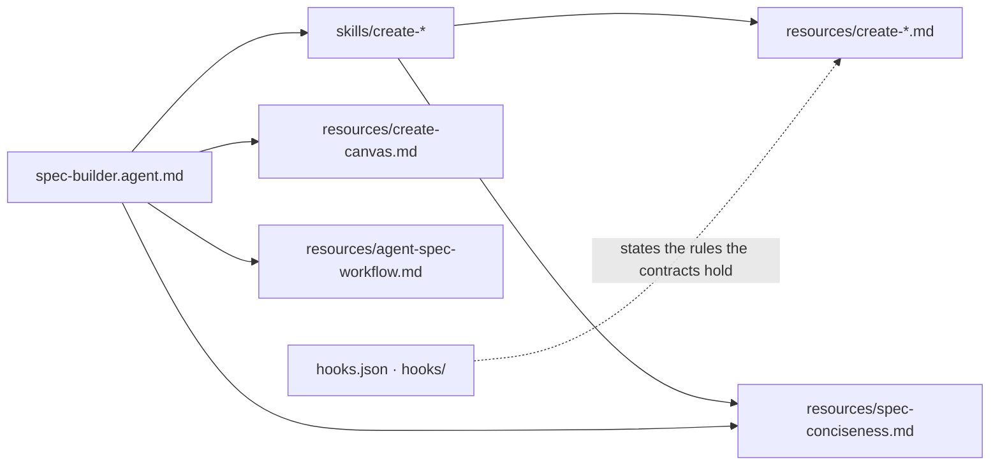

# spec-builder

```meta
related: [".devbook/arc42/05-building-block-view.md#specialists", ".devbook/arc42/08-crosscutting-concepts.md#one-file-two-hosts", ".devbook/arc42/08-crosscutting-concepts.md#rule-layering", ".devbook/arc42/adr/plugin-contracts.md"]
```

The authoring specialist, and the block every other block is written against. Its `create-*`
contracts say what an agent, a skill, a rule or contract, a plugin, a canvas, and a workflow
file must carry to load in both hosts from one copy; `spec-conciseness.md` holds the body
budgets. The rest of the repository points at these files by path instead of restating them,
so a change to an authoring rule is a change here.

It fills a role and holds no flow control: its agent plans, edits, and self-checks in one
conversation, and delegates only read-only search.

## Interfaces

```meta
```

### Contracts

```meta
```

| Contract | Governs |
| --- | --- |
| `create-agent.md` | `*.agent.md`: frontmatter, the union tools list, handoffs documented in the body |
| `create-skill.md` | `SKILL.md`: name, description, trigger, workflow, outputs |
| `create-instruction.md` | Where a rule lives: a repository rule with one wrapper per host, or a plugin contract in `resources/` |
| `create-plugin.md` | A plugin package: both manifests and their component paths |
| `create-canvas.md` | A Copilot canvas extension |
| `create-workflow.md` | A GitHub Actions workflow file |
| `spec-conciseness.md` | Pruning rules and the body budgets every asset is held to |
| `agent-naming.md`, `agent-spec-workflow.md`, `quick-reference.md` | Asset naming beside an agent, the single-agent authoring workflow, and a decision guide |

### Agent and Skills

```meta
```

Agent `spec-builder`, with the skills `create-agent`, `create-instruction`, `create-plugin`,
`create-skill`, and `create-workflow`. The `create-*` skills are model-invocable on purpose:
the agent dispatches them by name.

### Hooks

```meta
```

A `sessionStart` prompt in `hooks.json` states the naming, frontmatter, dual-host, and
conciseness rules, and its Claude twin is a command hook printing
`hooks/session-start-context.md` —
[SessionStart Twin Hook](../08-crosscutting-concepts.md#sessionstart-twin-hook).

## Structure

```meta
```



Each `create-*` skill reads its own contract and `spec-conciseness.md`, and nothing else in
the plugin. A canvas has a contract and no skill: the agent reads `create-canvas.md`
directly.

## Dependencies

```meta
```

| Depends on | Mechanism |
| --- | --- |
| `tools/check-assets.mjs`, `tools/tool-map.json` | The agent runs the checker before reporting an asset complete; the tools list follows the map |
| [08 — Crosscutting Concepts](../08-crosscutting-concepts.md) | The agent points at it for the dual-host rules |
| Copilot extension tools | `extensions_manage` and `extensions_reload` scaffold and reload a canvas |

| Depended on by | Mechanism |
| --- | --- |
| Every asset in the repository | `AGENTS.md` sends an author to the matching `create-*.md` before authoring an asset of that type |
| `.agents/rules/` | The `agents`, `skills`, and `plugin-contracts` rules cite `spec-conciseness.md` for their body budget |
| `.agents/rules/skill-invocation.md` | Names the `create-*` skills as agent-dispatched, so none may be marked user-invoked |

Neither host auto-applies a contract from inside a plugin, so every dependency on this block
is a path reference — [plugin contracts](../adr/plugin-contracts.md).
