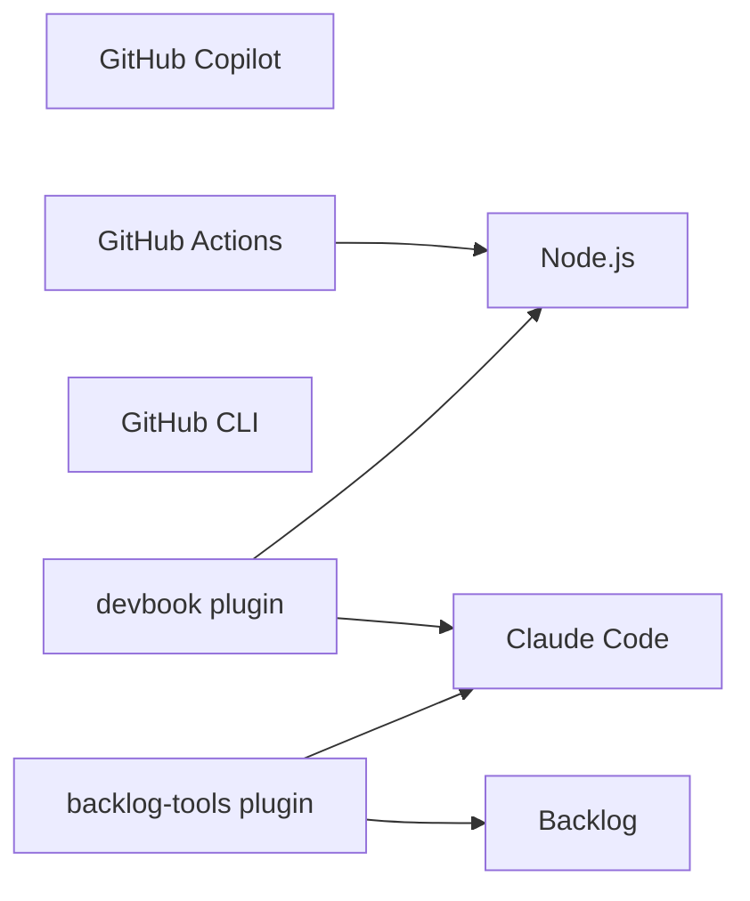

# Technology Graph

```meta
status: trial
```

> The technologies this marketplace is built, carried, and checked with. It ships no
> runtime of its own: every plugin is Markdown and JSON loaded by two hosts, so the graph
> is almost all tooling.

## Layers

| File | Covers |
| --- | --- |
| [tooling.md](tooling.md) | The two hosts that load the assets, the agent that authors them, the runtime the checkers run on, CI, and the plugins and apps a change is carried with |

The graph starts with the tools `ai/` rests on. A layer for the MCP servers and canvas
extensions the host plugins ship joins when those are registered.

## Graph



## Reading and extending

`status` is the tech-radar ladder in `devbook-tech.md`: `candidate`, `trial`, `adopted`,
`hold`, `retired`, rating each technology in this repository. Add a technology as a `##`
chapter in the layer that owns it, add its node and its `depends-on` edges here in the same
change, and run `node .devbook/_tools/devbook-meta/build.mjs --scope tech --check`.
