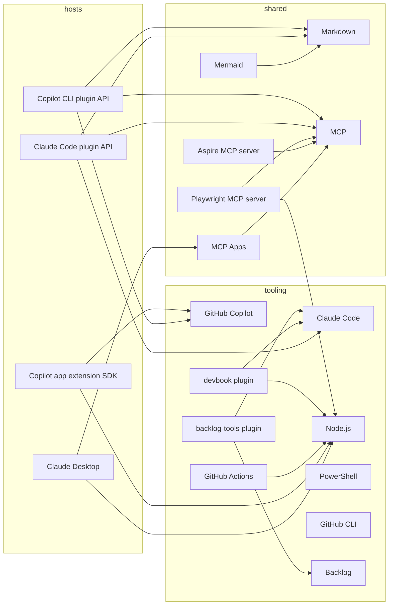

# Technology Graph

```meta
status: adopted
```

> The technologies this marketplace is built, carried, and checked with. It ships no
> runtime of its own: every plugin is Markdown and JSON loaded by two hosts, plus one MCP
> server and three canvases. What a specialist targets — Aspire, Playwright, Aikido, Jira —
> is the consuming repository's stack and is not recorded here, except for the MCP servers
> this repository's own manifests declare.

## Layers

| File | Covers |
| --- | --- |
| [shared.md](shared.md) | The formats assets are written in, the protocols a plugin reaches a tool server through, and the MCP servers the manifests declare |
| [hosts.md](hosts.md) | The plugin contracts of Claude Code and GitHub Copilot, and the two apps the host plugins render in |
| [tooling.md](tooling.md) | The agents that author and load the assets, the runtime and shell the scripts run on, CI, and the plugins and apps a change is carried with |

## Graph



## Reading and extending

`status` is the tech-radar ladder in `devbook-tech.md`: `candidate`, `trial`, `adopted`,
`hold`, `retired`, rating each technology in this repository. Add a technology as a `##`
chapter in the layer that owns it, add its node and its `depends-on` edges here in the same
change, and run `node .devbook/_tools/devbook-meta/build.mjs --scope tech --check`. Package
facts come from the inventory scripts under `.devbook/_tools/devbook-tech/`; this repository
has no .NET projects and three `package.json` files, only the canvases carrying a dependency.
