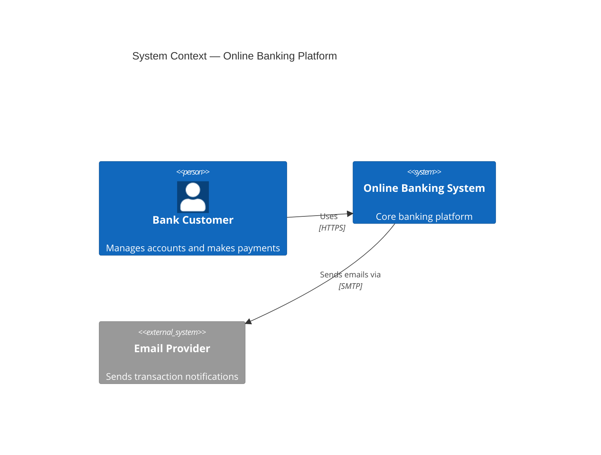
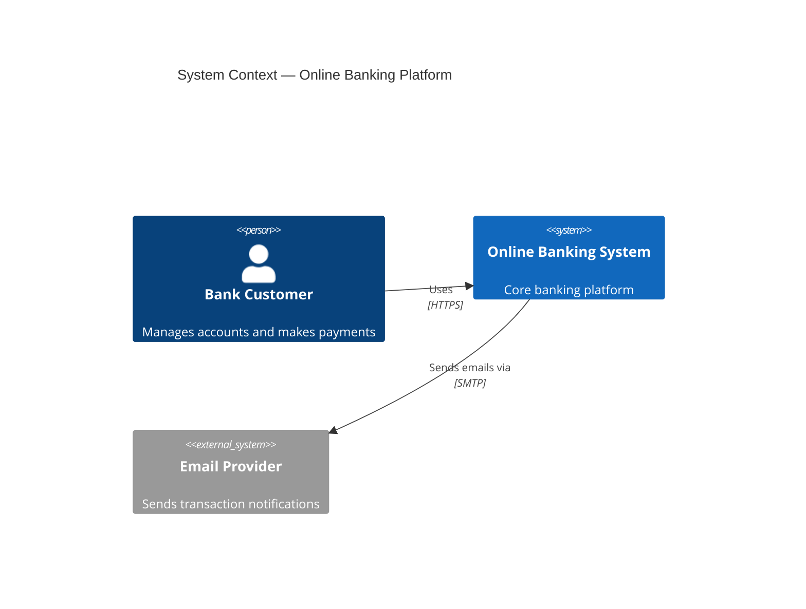
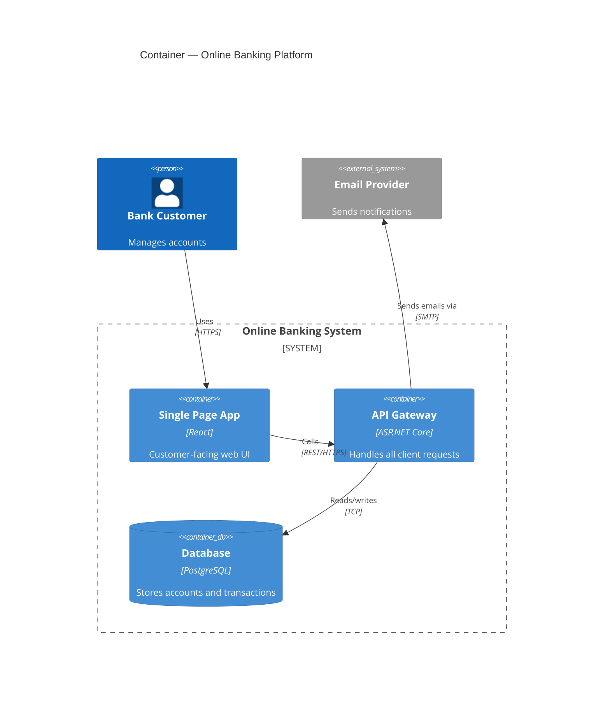
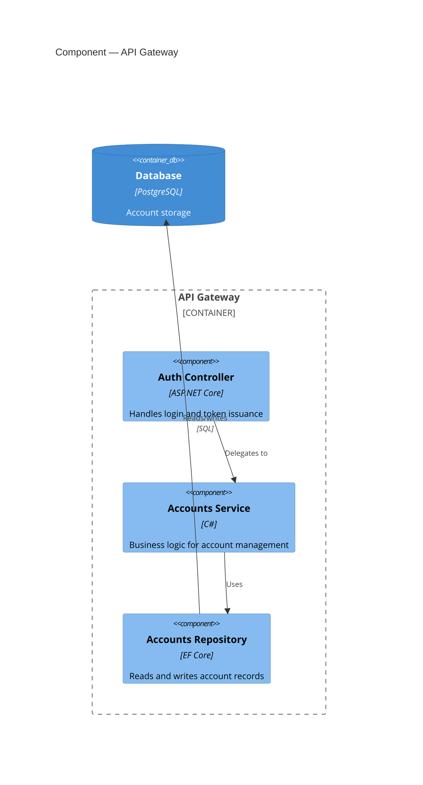

# C4 Model — Global Instructions

Prose follows `resources/prose.md`.

## What is the C4 Model?

The C4 model was created by Simon Brown as a simple, hierarchical notation for communicating software architecture to different audiences. It defines four levels of abstraction, each serving a different stakeholder group. C4 stands for **Context**, **Containers**, **Components**, and **Code**.

Official reference: <https://c4model.com>

## The Four Abstraction Levels

### Level 1 — System Context

- Shows the target system as a single box surrounded by its users and external systems.
- Audience: business stakeholders, product owners, and non-technical leadership.
- Scope: the entire system treated as a black box.
- Questions answered: What does the system do? Who uses it? What external systems does it depend on?

### Level 2 — Container

- Zooms into the system to show its high-level technology building blocks (containers).
- Audience: architects, developers, and DevOps teams.
- Scope: runnable or deployable units such as web apps, APIs, databases, message queues, and mobile apps.
- Questions answered: What are the major parts? What technology does each use? How do they communicate?

### Level 3 — Component

- Zooms into a single container to show its internal logical components.
- Audience: developers working on that specific container.
- Scope: logical groupings such as controllers, services, repositories, and domain models within one container.
- Questions answered: What are the responsibilities? How do components collaborate within the container?

### Level 4 — Code

- Zooms into a single component to show implementation-level detail.
- Audience: developers implementing or reviewing that component.
- Scope: classes, interfaces, and their relationships.
- Questions answered: How is it implemented? What are the class relationships and design patterns?

## Notation Standards

### Element Types

| Element | Level | Description |
| --- | --- | --- |
| `Person` / `Person_Ext` | 1, 2, 3 | A human user (internal / external) |
| `System` / `System_Ext` | 1 | A software system (in scope / external) |
| `Container` / `ContainerDb` | 2 | A runnable unit or data store |
| `Component` | 3 | A logical grouping inside a container |
| Class / Interface | 4 | Implementation artifact |

### Relationship Conventions

- Label every relationship with a verb phrase (e.g., "reads data from", "sends events to").
- Specify protocol or technology when relevant (e.g., HTTPS, gRPC, AMQP, SQL).
- Use directional arrows; avoid bidirectional arrows unless the interaction is truly symmetric.
- Do not draw inferred relationships — only model what is architecturally significant.

### Naming Conventions

- Use short, meaningful names for all elements (maximum 3 words).
- Use bracketed technology labels in container and component diagrams (e.g., `[React SPA]`, `[PostgreSQL]`).
- Distinguish internal from external elements using the `_Ext` variants.

## Color Conventions

Apply this palette consistently across every C4 diagram using Mermaid's `UpdateElementStyle(alias, $bgColor="...", $fontColor="...", $borderColor="...")` directive. Color is additive — it reinforces the `_Ext` naming convention and element type, it never replaces the text label.

| Element Type | Background | Border | Font | Meaning |
| --- | --- | --- | --- | --- |
| `Person` (internal) | `#1168BD` | `#0B4884` | `#FFFFFF` | In-scope human actor |
| `Person_Ext` | `#999999` | `#6B6B6B` | `#FFFFFF` | External human actor |
| `System` (in scope) | `#1168BD` | `#0B4884` | `#FFFFFF` | The system being described |
| `System_Ext` | `#999999` | `#6B6B6B` | `#FFFFFF` | External/third-party system |
| `Container` | `#438DD5` | `#2E6295` | `#FFFFFF` | Runnable/deployable unit |
| `ContainerDb` | `#438DD5` | `#2E6295` | `#FFFFFF` | Data store container |
| `Component` | `#85BBF0` | `#5D82A8` | `#000000` | Logical component inside a container |

Apply the same palette to every level so a reader can tell in-scope vs. external elements at a glance regardless of which C4 level they are viewing.

Note: Mermaid's C4 renderer emits no per-element ids/classes in its SVG output, so C4 diagrams are not interactively clickable in any Mermaid-based viewer (Mermaid `click` directives do not work on C4 elements). Colour is therefore the primary way to convey element type/scope at a glance for C4 diagrams regardless of how they are viewed.

### Example — Level 1 with Color Convention



## Preferred Notation: Mermaid C4

Prefer Mermaid C4 notation for all C4 diagrams in Markdown documents. Mermaid renders natively in GitHub and GitHub Copilot chat without additional tooling.

### Mermaid C4 Diagram Keywords

| Level | Mermaid Keyword |
| --- | --- |
| System Context | `C4Context` |
| Container | `C4Container` |
| Component | `C4Component` |
| Code | `classDiagram` (standard UML class notation) |

### Example — Level 1 System Context



### Example — Level 2 Container



### Example — Level 3 Component


```

## Scope Guidelines

- Level 1: one diagram per project is usually sufficient.
- Level 2: one diagram per system; add a separate diagram per bounded context when the system is large.
- Level 3: one diagram per container; focus on architecturally significant containers.
- Level 4: use sparingly; only for components with non-obvious class structure or critical design decisions.

## Output Rules

- Embed all diagrams in fenced `mermaid` code blocks.
- Follow every diagram with a prose summary (3–5 sentences) explaining key relationships and design decisions.
- Include a note block for any non-standard symbols or conventions.
- Produce one diagram per level per scope; create multiple diagrams only when the scope genuinely requires it.
- Store diagrams inside the arc42 sections where they belong; do not create standalone diagram files.

## Traceability

- Link Level 1 diagrams to arc42 Section 3 (Context and Scope).
- Link Level 2 diagrams to arc42 Section 5 (Building Block View) and Section 7 (Deployment View).
- Link Level 3 diagrams to arc42 Section 5 (Building Block View — deeper levels).
- Reference relevant ADRs for every technology choice visible in Level 2 and Level 3 diagrams.
