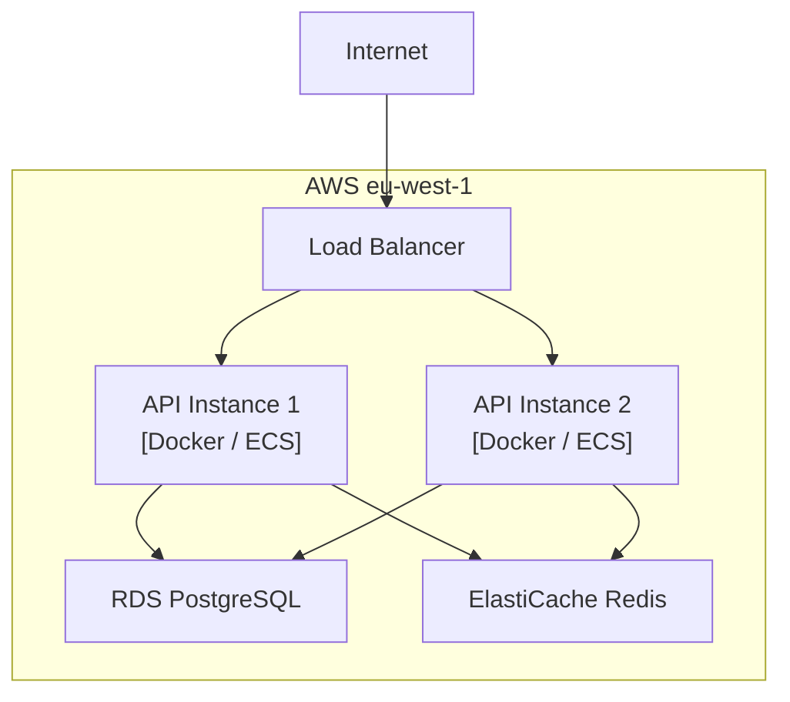

# Deployment Diagrams — Global Instructions

Prose follows `resources/prose.md`.

## Purpose

Deployment diagrams model the physical and logical infrastructure on which a system runs: nodes (servers, containers, cloud services), artifacts deployed to them, and the network relationships between them. They are the primary tool for documenting arc42 Section 7 (Deployment View).

## Relationship to C4 Diagrams

- **C4 Level 2 (Container)** shows *what* runs — the logical deployment units.
- **Deployment diagrams** show *where* it runs — the physical or cloud infrastructure hosting those units.
- Both views are complementary; a complete arc42 §7 typically includes a C4 Level 2 diagram for the logical view and a deployment diagram for the infrastructure view.

## When to Use

- Documenting how the system is hosted (cloud provider, on-premises, hybrid).
- Showing environment differences (development, staging, production).
- Mapping containers or services to cloud services, VMs, or Kubernetes resources.
- Capturing network zones, firewalls, and load balancers that affect security or availability.

## Preferred Notation: Mermaid Architecture Diagram

Prefer the Mermaid `architecture-beta` diagram type for infrastructure and cloud topologies. It renders native cloud/infra icons and supports grouping by logical boundary.

> **Note:** `architecture-beta` requires Mermaid v11 or later. Verify renderer compatibility before use. Fall back to `graph TD` when the target environment does not support v11+.

### Mermaid `architecture-beta` Syntax

Available icon types: `cloud`, `server`, `database`, `disk`, `internet`, `function`, `gateway`.

### Fallback: Mermaid `graph TD`

Use when `architecture-beta` is not supported:

## Scope Guidance

- One diagram per environment or per deployment tier when environments differ significantly.
- Show production as the primary diagram; add staging or development diagrams only when they differ architecturally.
- Do not duplicate the C4 Container diagram's logical detail; reference it instead.
- Include network zones (VPC, subnet, DMZ) and security boundaries when they are architecturally relevant.

## Naming Conventions

- Name nodes using their role and technology (e.g., `"API Gateway [AWS API GW]"`, `"Primary DB [PostgreSQL 16]"`).
- Label groups with environment and cloud region (e.g., `"Production — AWS eu-west-1"`).
- Label relationships with the protocol and port where relevant (e.g., `HTTPS:443`, `TCP:5432`).

## Output Rules

- Embed diagrams in fenced `mermaid` code blocks.
- Specify which Mermaid diagram type is used and note any version requirements.
- Follow each diagram with a prose summary (3–5 sentences) calling out hosting choices, scaling strategy, and key security boundaries.
- Store diagrams inside the arc42 Section 7 document.

## Traceability

- Link to arc42 Section 7 (Deployment View) as the primary home.
- Cross-reference the C4 Level 2 Container diagram for the logical view of the same system.
- Reference relevant ADRs for cloud provider selection, region strategy, and scaling decisions.
