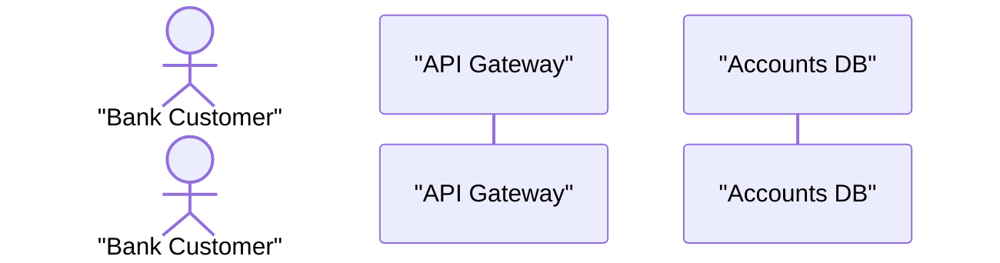
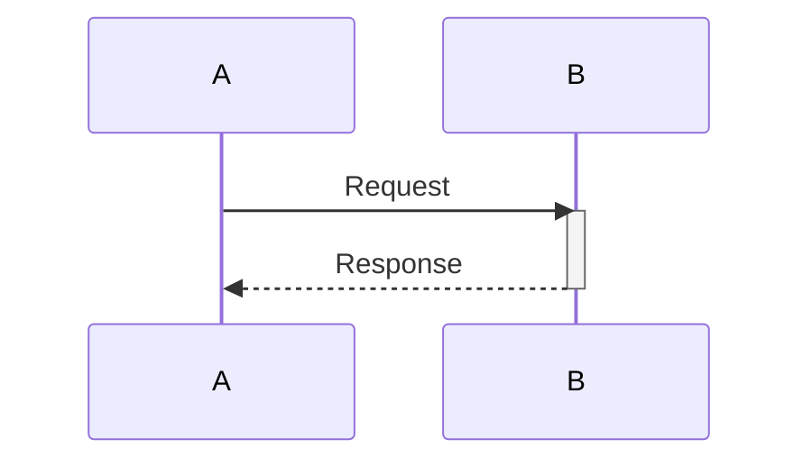
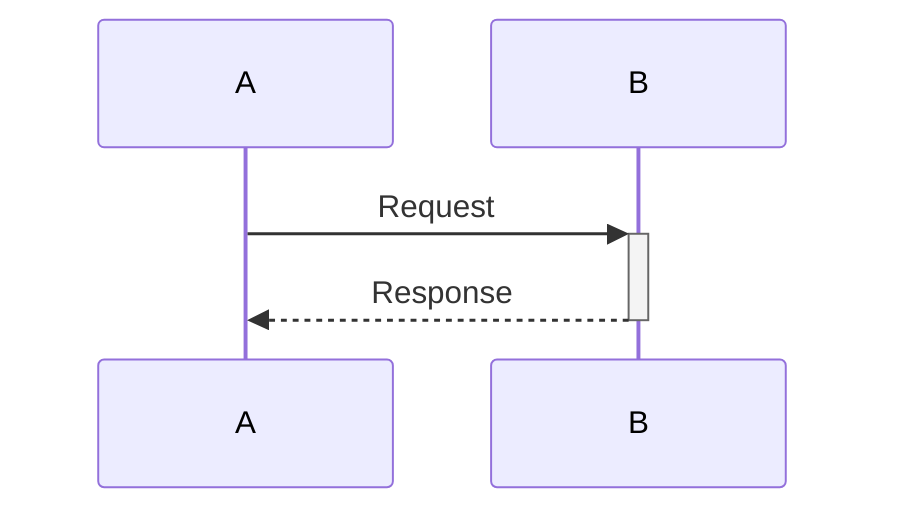
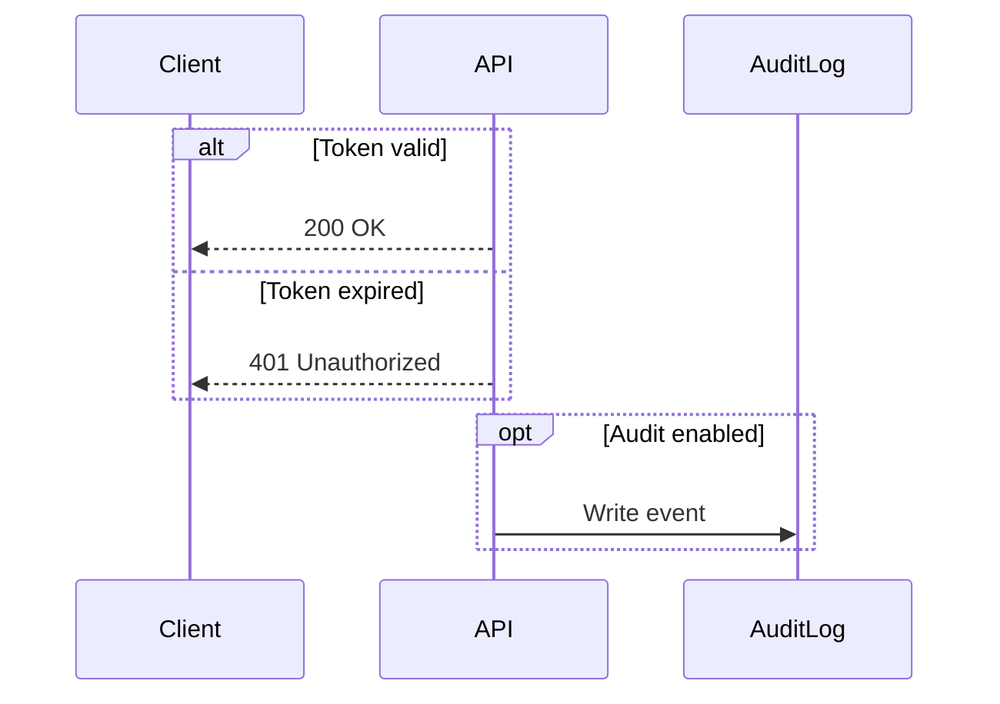
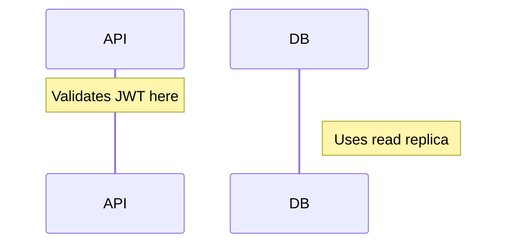

# Sequence Diagrams — Global Instructions

Prose follows `resources/prose.md`.

## Purpose

Sequence diagrams model the runtime behavior of a system by showing how participants exchange messages over time. They are the primary tool for documenting arc42 Section 6 (Runtime View) scenarios.

## When to Use

- Documenting a specific use case, API call chain, or integration flow.
- Showing how the system responds to a key event (happy path and error paths).
- Making implicit timing and ordering assumptions explicit.
- Complement C4 Container or Component diagrams with a dynamic view of the same scope.

## Scope Guidance

- One diagram per scenario; do not combine unrelated flows in a single diagram.
- Prefer 3–8 participants per diagram; split complex flows into sub-scenarios.
- Cover the happy path first; add error and edge-case flows as separate diagrams only when architecturally significant.

## Mermaid Syntax Reference

### Participants and Actors

Use `actor` for human participants and `participant` for systems, services, or components.

### Message Types

| Arrow | Meaning |
| --- | --- |
| `->>` | Synchronous call (solid line, open arrowhead) |
| `-->>` | Synchronous reply (dashed line, open arrowhead) |
| `-x` | Asynchronous message (solid line, X arrowhead) |
| `--x` | Failed / error reply |

### Activation Bars

Use `activate` / `deactivate` to show when a participant is processing:

Or use the shorthand `+` / `-` on arrows:

### Combined Fragments

| Fragment | Mermaid Keyword | Use Case |
| --- | --- | --- |
| Alternative | `alt` / `else` | Conditional branches |
| Optional | `opt` | Behaviour that may not occur |
| Loop | `loop` | Repeated behaviour |
| Parallel | `par` | Concurrent execution |
| Critical | `critical` | Atomicity / transaction boundary |
| Break | `break` | Early exit from a flow |

### Notes

## Naming Conventions

- Use short, role-based names for participants (e.g., `"Order Service"`, not `"com.example.OrderServiceImpl"`).
- Alias participant identifiers to readable display names using `as "..."`.
- Prefix scenario titles with the triggering actor or event (e.g., `"Customer places order"`).

## Output Rules

- Embed diagrams in fenced `mermaid` code blocks.
- Add a title comment at the top of each diagram (e.g., `%% Scenario: Customer Login`).
- Follow each diagram with a prose summary (2–4 sentences) calling out the key ordering decisions, error handling, and any timing constraints.
- Store diagrams inside the arc42 Section 6 document.

## Traceability

- Link to arc42 Section 6 (Runtime View) as the primary home for sequence diagrams.
- Cross-reference the C4 Container or Component diagram that provides the structural context.
- Reference relevant ADRs for integration or protocol choices visible in the diagram.
