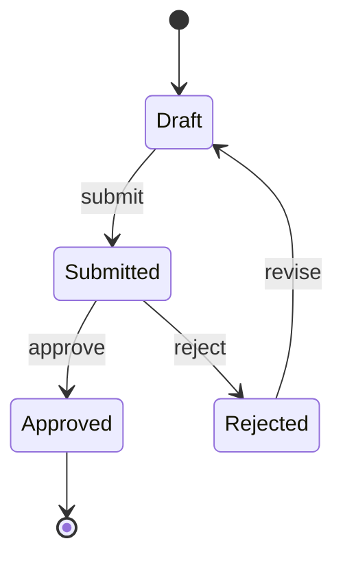
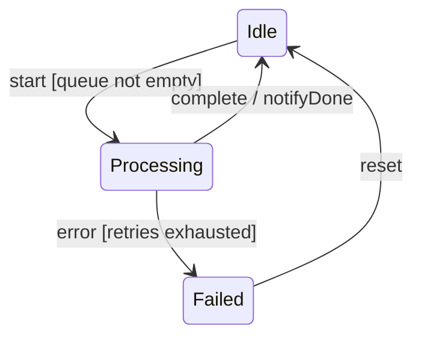
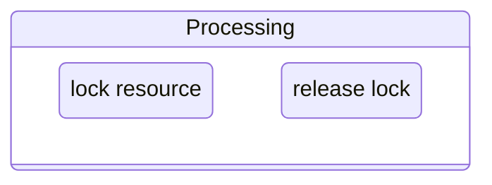
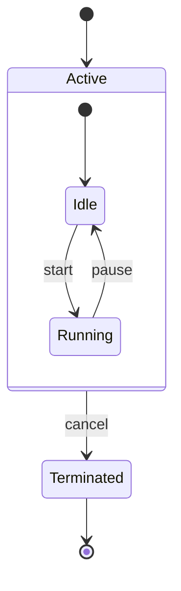
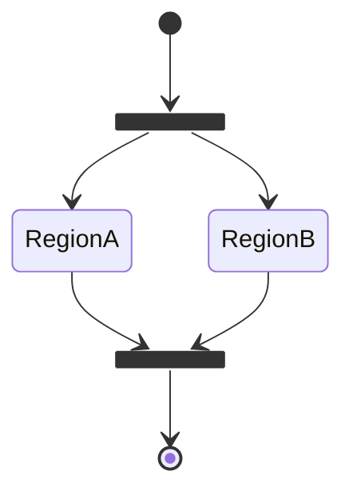
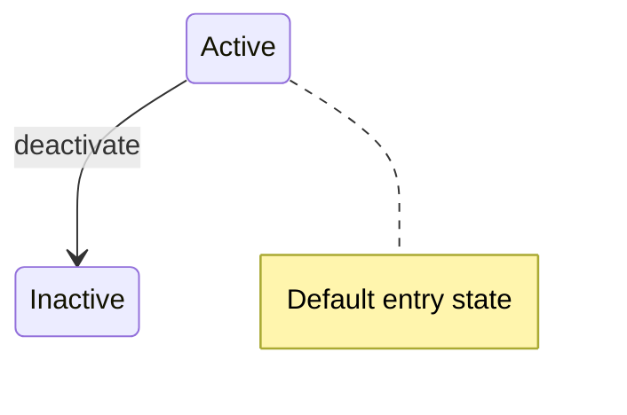

# State Machine Diagrams — Global Instructions

Prose follows `resources/prose.md`.

## Purpose

State machine diagrams model the lifecycle of a stateful entity by showing its possible states, the events that trigger transitions between them, and any actions taken on entry, exit, or transition. They are used in arc42 Section 6 (Runtime View) for behavioural scenarios and Section 8 (Crosscutting Concepts) for shared lifecycle patterns.

## When to Use

- Documenting the lifecycle of a domain aggregate (e.g., `Order`, `Subscription`, `Payment`).
- Modelling a workflow or approval process with explicit state guards.
- Clarifying ambiguous or complex state transitions that prose alone cannot express clearly.
- Describing protocol-level state (e.g., connection states, circuit-breaker states).

## When Not to Use

- Simple two-state toggles (active/inactive) that are obvious from context.
- General flow charts or decision trees (use a flowchart instead).
- Modelling interactions between multiple participants (use a sequence diagram instead).

## Mermaid Syntax Reference

### Basic State Diagram



`[*]` denotes the initial state (top) and the final state (bottom).

### Transition Labels

Label every transition with the triggering event and, optionally, a guard condition:

```
State --> NextState: event [guard] / action
```



### Entry and Exit Actions



### Composite States (Nested)

Use composite states to show sub-states within a parent state:



### Fork and Join (Concurrent Regions)



### Notes



## Naming Conventions

- Name states with a noun or noun phrase in PascalCase (e.g., `OrderPlaced`, `PaymentPending`).
- Use the ubiquitous language of the domain; do not use technical status codes (e.g., prefer `Approved` over `STATUS_3`).
- Label transitions with the domain event or command that triggers them (e.g., `submit`, `paymentReceived`).
- Add guard conditions in square brackets when the same event can lead to different states.

## Scope Guidance

- One diagram per entity or protocol; do not combine the state machines of multiple entities.
- Limit to 10–15 states per diagram; extract sub-machines into separate diagrams if the state space grows larger.
- Show only the states and transitions that are architecturally significant; omit internal implementation states.

## Output Rules

- Embed diagrams in fenced `mermaid` code blocks.
- Add a comment at the top identifying the entity or protocol being modelled (e.g., `%% State machine: Order lifecycle`).
- Follow each diagram with a prose summary (2–4 sentences) explaining key lifecycle decisions, guards, and side effects.
- Store diagrams inside arc42 Section 6 or Section 8, depending on whether they model a specific scenario or a crosscutting pattern.

## Traceability

- Link to arc42 Section 6 (Runtime View) for scenario-specific state machines.
- Link to arc42 Section 8 (Crosscutting Concepts) for shared lifecycle or protocol patterns.
- Cross-reference the domain model or aggregate definition where the entity is described.
- Reference relevant ADRs for state management or persistence decisions.
